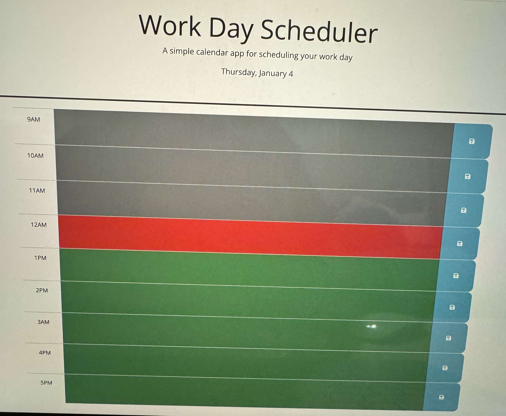

# Module-4HW

This challenge was a good way of getting comfortable with many factors that we have learned in class. Getting comfortable wiht JavaScript and bootstap and index.HTML and along with jQuery.

## Features
    This challenge mainly focused on making a schduler for user to keep track of things they have to do throughout their day 9-5. Also, this would keep all the stuff in storage when needed to retrieve any information. 

## usuage
   This was overall a great way of getting practice with bootstap and all the componenets that it has to offer. Also, got a bit more comfortable with using jQuery and what it has to offer to make life i bit easier. 

###
    Technology that was used for this portfolio was 
    HTML, 
    CSS, 
    reset.css, 
    javaScript,
    GitHub
    jQuery and
    Bootstrap

[Do visit my page](https://github.com/johria123/module-5HW)